# Wazuh SOC Detection & Response Home Lab
 
A SOC detection lab built on Wazuh. I run real attacks against a Windows and a Linux endpoint, detect them in Wazuh, auto block one of them, and document how I'd triage each alert.

 - Built by Hooper

   > **Companion project:** [Active Directory Security Lab](https://github.com/suepercrab/ActiveDirectory-Security-Lab) — password spraying, Kerberoasting, and BloodHound detection with Splunk SPL queries.
   
---
 
**Contents:** [Environment](#environment) · [Endpoint visibility](#endpoint-visibility) · [SCA posture scan](#sca-posture-scan) · [Custom rule + active response](#custom-rule--active-response) · [Attacks detected](#attacks-detected) · [Triage](#triage) · [What I learned](#what-i-learned-and-whats-next)

## What's in here
 
- Wazuh SIEM with a Windows and a Linux agent enrolled
- Endpoint telemetry from Sysmon (Windows) and auditd (Linux)
- SCA (CIS benchmark) posture scan with before/after remediation
- A custom correlation rule I wrote and tuned to this environment
- Active response that blocks an attacker's IP automatically after repeated auth attempts
- Attacks run and detected, mapped to MITRE ATT&CK
- Triage notes calling each alert a true or false positive, with the respective reasoning
---
 
## Environment
 
| Host | Role | IP |
|------|------|-----|
| Wazuh SIEM | Manager + dashboard (Amazon Linux 2023 OVA) | 10.0.40.60 |
| Ubuntu-Endpoint | Linux endpoint, agent 001 | 10.0.40.61 |
| WIN11 | Windows 11 endpoint, agent 002 | 10.0.40.20 |
| Kali | Attacker | 10.0.40.50 |
| DC01 | Domain controller (from my [AD lab](https://github.com/suepercrab/ActiveDirectory-Security-Lab)) | 10.0.40.10 |
 
Host is Linux Mint machine, running VirtualBox. Everything runs on an isolated internal network (`labnet`, 10.0.40.0/24) with no internet access 
 
---
 
## Wazuh online
 
Deployed the Wazuh OVA and got the dashboard up at 10.0.40.60. 
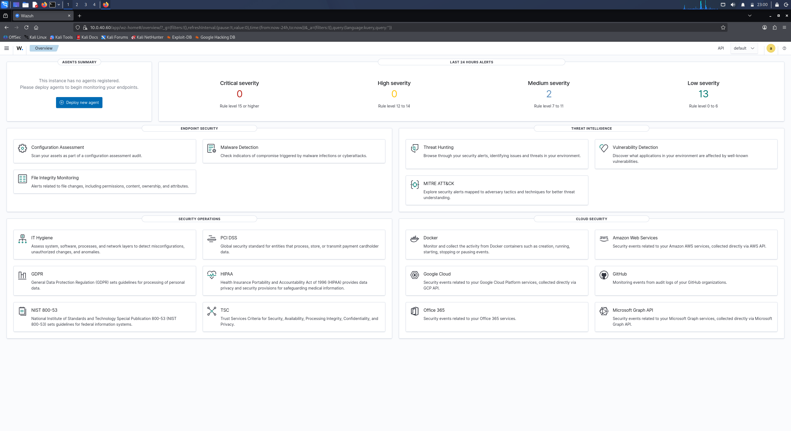
 
---
 
## Agents enrolled
 
Both endpoints enrolled and Active — Ubuntu-Endpoint as agent 001, WIN11 as agent 002.
 
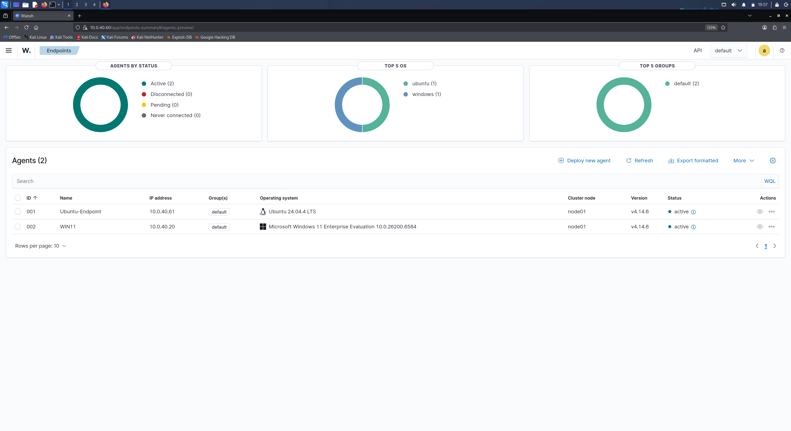
 
---
 
## Endpoint visibility
 
Installed Sysmon on WIN11 and added its `localfile` block to `ossec.conf` so the process and network telemetry reaches Wazuh. Set up auditd on Ubuntu so every command run gets logged.
 
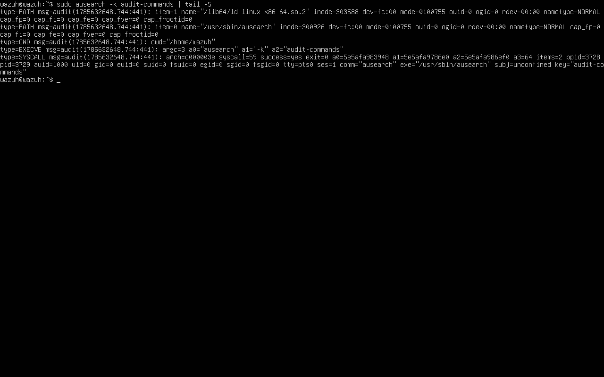
 
Here's the Linux side working — sudo to root, caught and alerted:
 
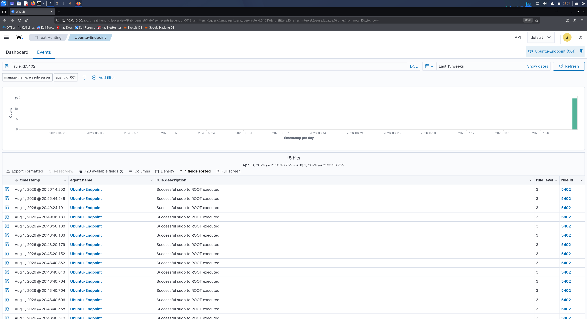
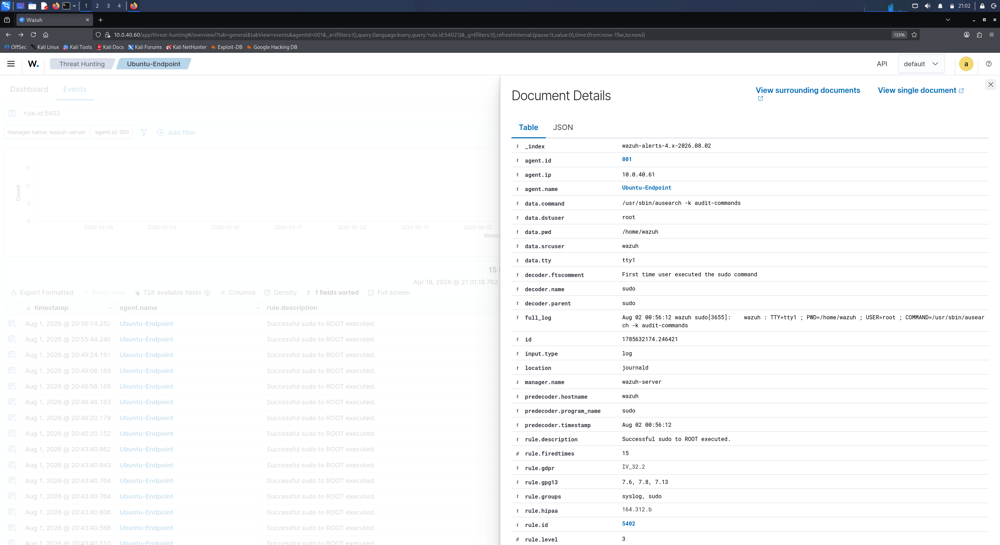
 
---
 
## SCA posture scan
 
Ran a Security Configuration Assessment (CIS benchmark) against Ubuntu. Took a baseline, fixed two clusters — sysctl network hardening and cron permissions, then I scanned the Ubuntu endpoint again
 
Before:
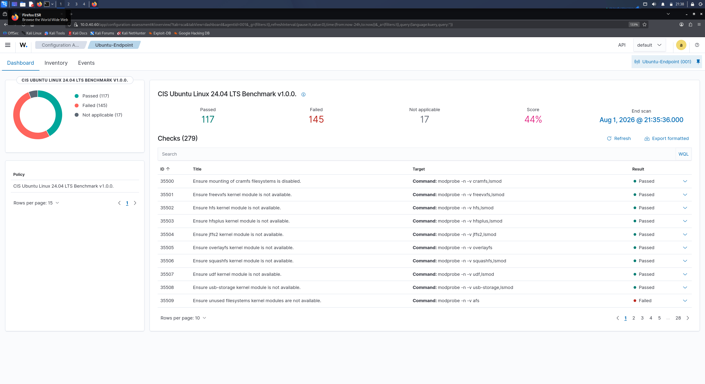
 
After:
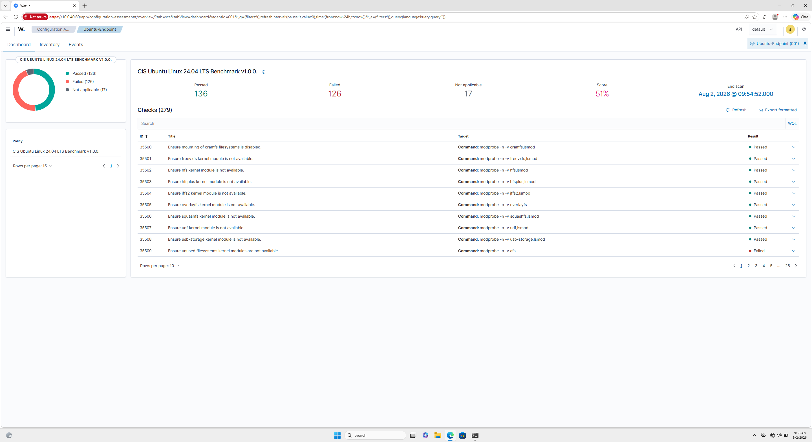
 
Score went from 44% to 51%.
 
---
 
## Custom rule + active response
 
Wrote rule 100100. It fires when there are 8+ SSH auth failures inside 60 seconds from the same source IP. I scoped it with `<same_source_ip/>` so it only triggers on one source hammering the box not multiple unrelated failures scattered across the network. Set it to level 12 and tagged it T1110.
 
```xml
<group name="local,authentication_failures,">
  <rule id="100100" level="12" frequency="8" timeframe="60">
    <if_matched_sid>5760</if_matched_sid>
    <same_source_ip/>
    <description>Possible SSH brute force: 8+ failed logons in 60s from same source</description>
    <mitre>
      <id>T1110</id>
    </mitre>
  </rule>
</group>
```
 
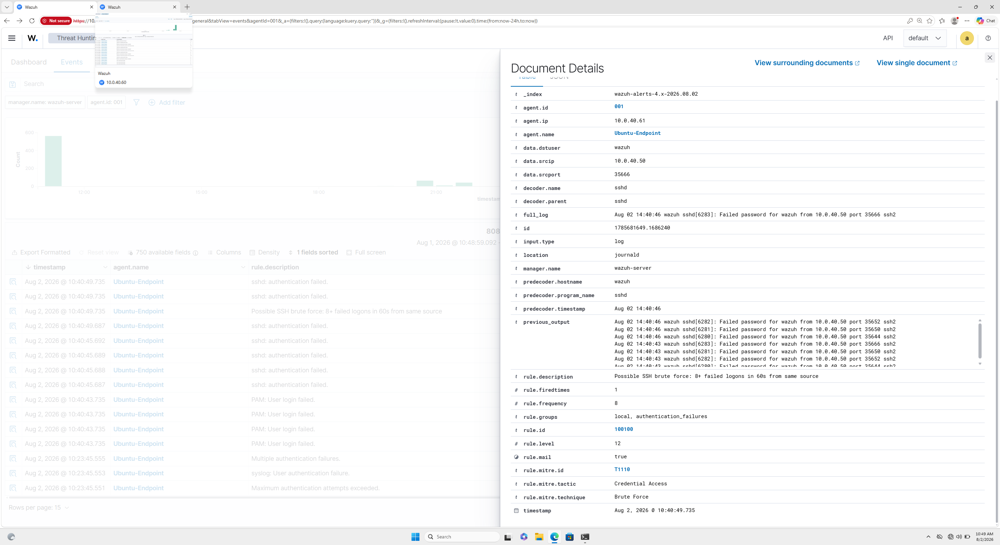
 
Then bound a firewall drop active response to it with a 120 second timeout. When the rule fires, Wazuh blocks the source IP at the endpoint firewall on its own.
 
---
 
## Attacks detected
 
Each attack runs against the isolated lab, gets caught in Wazuh, and maps to a MITRE technique.
 
### T1110 — SSH brute force (detect and respond)
 
Ran hydra from Kali against Ubuntu:
 
```bash
hydra -l wazuh -P /usr/share/wordlists/rockyou.txt ssh://10.0.40.61 -t 4
```
 
It stalls after about 16 attempts. Rule 100100 caught the failure burst and the active response dropped Kali's IP mid-attack, so the rest of the tasks hang on dead connections. The attack getting cut off is the proof the response worked.
 
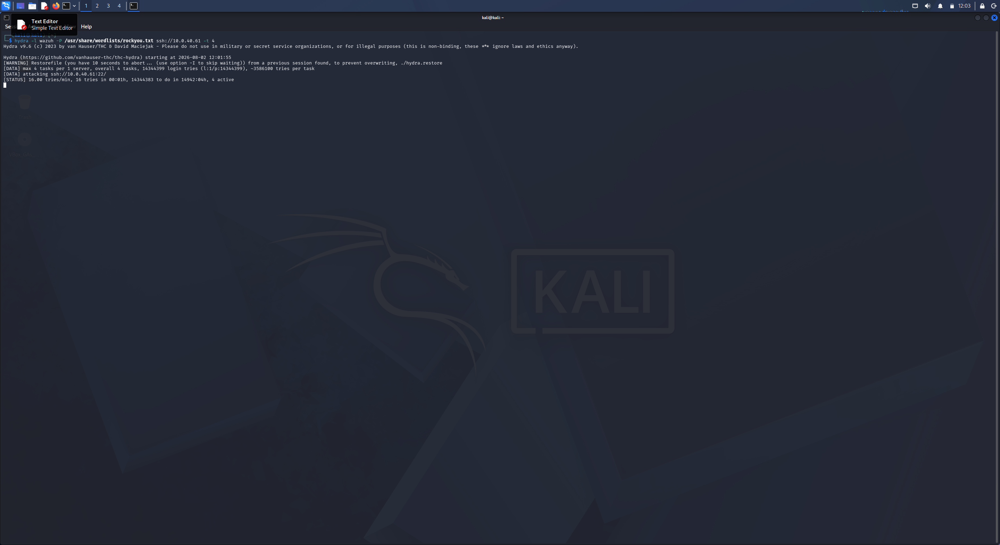
 
Rule 100100 (level 12) fired, and rule 651 confirms the firewall-drop kicked in:
 
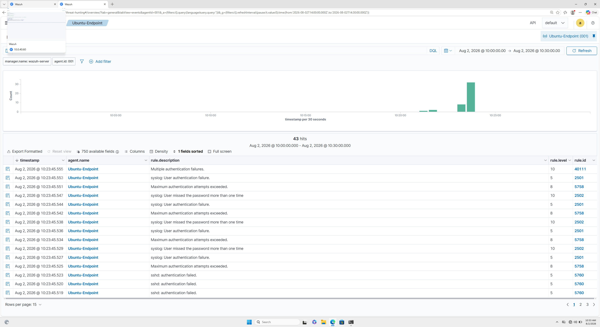
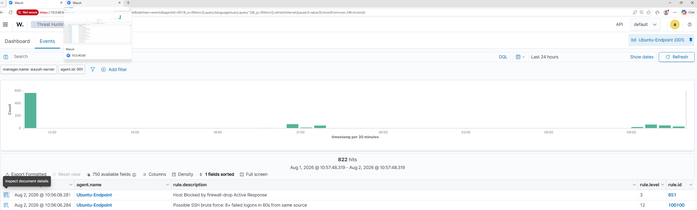
 
The `active-responses.log` shows the whole thing — the attacker IP added, then deleted when the 120s timeout ran out:
 
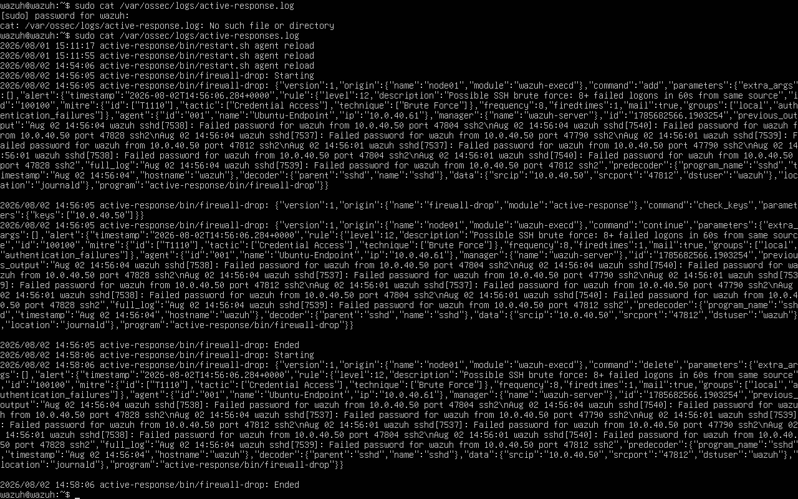
 
### T1059.001 — Encoded PowerShell
 
Ran an obfuscated PowerShell command on WIN11 — base64 payload, hidden window, no profile. Same pattern real malware uses to hide what it is running 
 
```powershell
powershell.exe -NoProfile -WindowStyle Hidden -EncodedCommand <base64>
```

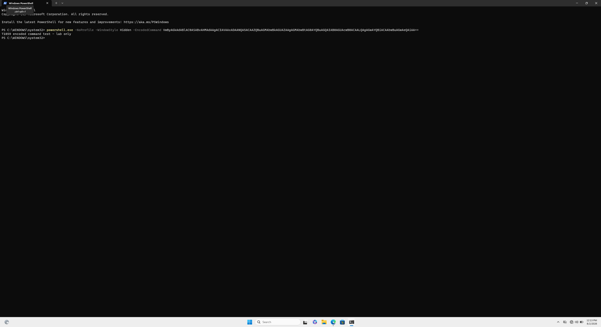
 
The payload is harmless (just a `Write-Host` test string). The command line pattern is what gets caught. Sysmon logs the full command line at process creation, plain Windows logging wouldn't show the `-EncodedCommand` argument at all.
 
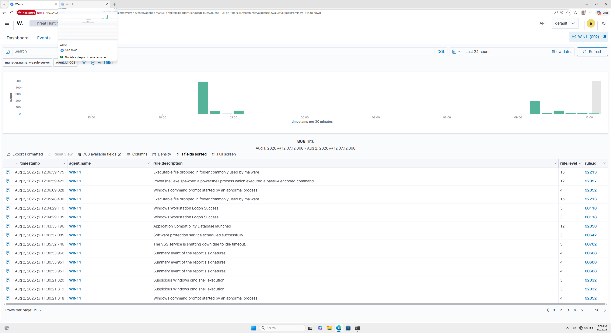
 
Rule 92057 (level 12) flagged it. The expanded alert has everything; the full command line, the parent process (`powershell.exe` as `WIN11\vboxuser`), file hashes, and integrity level:
 
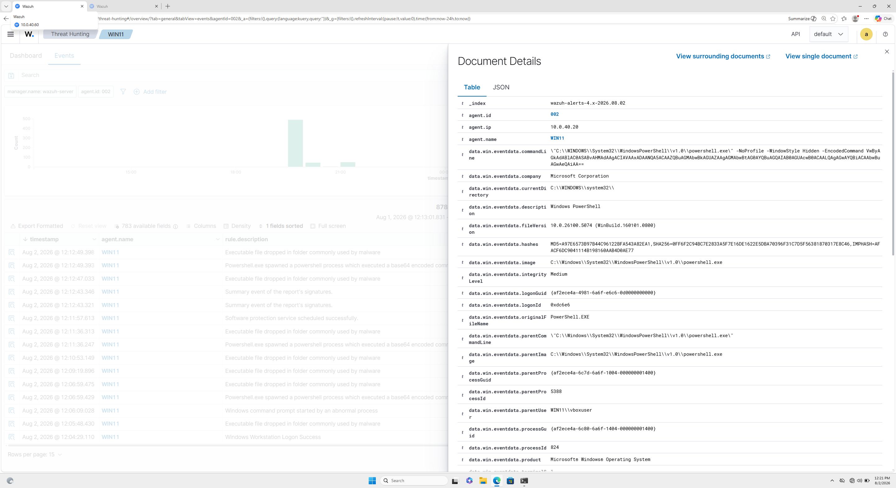
 
### T1046 — Network scan (what Wazuh can't see)
 
Ran a stealth scan from Kali:
 
```bash
nmap -sS 10.0.40.61
```
 
No alert was seen in Wazuh Dashboard and that's expected. Wazuh is host based; it works off logs. A SYN scan never finishes the handshake, so no service accepts the connection and nothing gets logged. I hit the same wall in my [AD Security Lab](https://github.com/suepercrab/ActiveDirectory-Security-Lab) — the scan was invisible to Splunk for the same reason. Two different SIEMs, same blind spot, because both are consuming host logs rather than watching the wire.
 
### Summary
 
| Technique | MITRE | Tool | Caught by |
|-----------|-------|------|-----------|
| SSH brute force | T1110 | hydra | Rule 100100 + active response (651) |
| Encoded PowerShell | T1059.001 | powershell.exe | Sysmon &rarr; rule 92057 |
| Network scan | T1046 | nmap `-sS` | Nothing detected, due to SIEM blind spot |
 
---
 
## Triage
 
Describes each alert I found, if its a cause for concern, and how I would respond 
 
### Incident 1 — True positive: SSH brute force
 
- Alert: rule 100100, level 12 — "Possible SSH brute force: 8+ failed logons in 60s from same source"
- Investigation: `data.srcip` shows every failure coming from one host, the Kali attacker (10.0.40.50). `rule.frequency` confirms 8 failures inside the 60s window. One source hitting one service like that is a targeted brute force, not someone simply incorrectly inputting a password.
- Verdict: true positive.
- Response: active response fired (rule 651) and blocked the IP for 120s — confirmed in `active-responses.log`. Attack stalled.
- In production: make the block permanent, look into the source host, and check whether that account should even be reachable.
### Incident 2 — True positive: encoded PowerShell
 
- Alert: rule 92057, level 12 — "Powershell.exe spawned a powershell process which executed a base64 encoded command"
- Investigation: pulled the base64 out of the command line and decoded it — `Write-Host "T1059 encoded command test - lab only"`. The flags (`-EncodedCommand -WindowStyle Hidden -NoProfile`) are the standard way malware hides what it's running.
- Verdict: true positive (lab test). In the real world this command-line pattern gets attention no matter what it decodes to.
- In production: isolate the host, find the parent process that launched PowerShell, and hunt the same pattern on other machines.
- Note: decoding the payload instead of just reading the alert title is the step that tells you whether the hidden command is safe or not.
### Incident 3 — False positive: PowerShell policy test
 
- Alert: rule 92205, level 9 — PowerShell activity on WIN11
- Investigation: the thing that triggered it is `__PSScriptPolicyTest_`, a temp script Windows writes to check its own execution policy. Normal OS behavior, not an attacker.
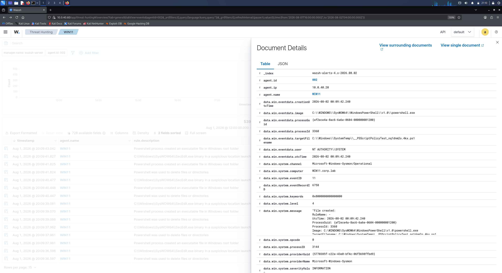
 
- Verdict: false positive.
- In production: tune or suppress it so it stops eating analyst attention.
### Incident 4 — False positive: "executable dropped in malware folder"
 
- Alert: rule 92213, level 15 — "Executable file dropped in folder commonly used by malware"
- Context: this kept firing at the same timestamps as the encoded-PowerShell test above.
- Investigation: expanded the event and the flagged executable is `powershell.exe` itself, running from `C:\Windows\System32\WindowsPowerShell\v1.0\`. The ruleset treats PowerShell in that path as a malware-folder hit. Parent process and hashes match the real Microsoft-signed binary — it's the OS running its own signed executable, kicked off by my T1059 test.

  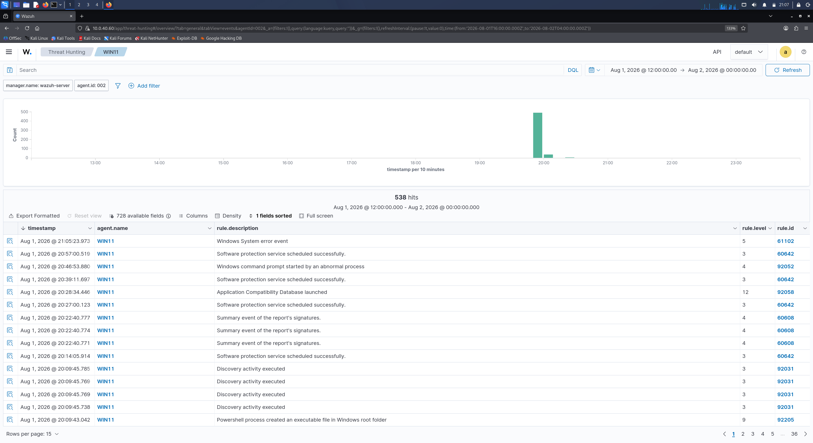
  
- Verdict: false positive, a side effect of my own test.
- In production: correlate it against known activity (my test, here) and tune the rule to exclude the signed system binary.
- Note: this one fired at level 15, the highest severity on the board, and still turned out benign. The severity number tells you to look, not what the answer is. Chasing every max severity alert without triaging can be a burn out and can cause true alerts to be overlooked 
---
 
## What I learned and what's next
 
What this lab taught me:
 
- Host based detection is deep on the endpoint. It sees process creation, command lines, and file changes in detail, but a stealth network scan is invisible to it. Real coverage needs both a HIDS and network sensors deployed.
- Severity is a starting point for triage, not a solid verdict. Two of my four alerts were false positives, and one of those was a level 15. You have to investigate each threat before you escalate.
- The command line is the evidence. The encoded-PowerShell detection worked entirely off Sysmon capturing the full command line, without it, that alert would've been near useless.
- Writing my own rule taught me more than any built in one. Wazuh already flags brute force out of the box, but building 100100 myself helped me to understand the syntax that goes into designing future rules, also how to translate the syntax into plain text reasoning
What I'd add next:
 
- A network sensor (Zeek or Suricata) to close the T1046 gap and catch the recon that Wazuh and other SIEMs can't.
- More detections over time — credential dumping, scheduled-task persistence, lateral movement — added as separate commits to this repo.
- Tuning passes to suppress the false positives I found here, so the signal-to-noise ratio keeps improving.
I plan to keep improving and detailing this repo overtime as my knowledge and experience grows in this environment.
 
---
 
## Skills shown
 
- SIEM deployment and admin — Wazuh manager, agent enrollment, endpoint config
- Detection engineering — wrote and tuned a custom correlation rule with environment specific scoping
- Automated response — active response firewall blocking, verified end to end
- Endpoint telemetry — Sysmon and auditd
- Posture assessment — SCA (CIS) scan with measurable remediation
- Attack simulation — ran and detected T1110 and T1059.001, mapped to MITRE ATT&CK
- Triage — four incident verdicts (two true, two false positive), including a level 15 false positive ruled out
- Knowing the limits — documented why Wazuh can have blind spots and why you must combine Wazuh with other services
## MITRE ATT&CK coverage
 
| Tactic | Technique | ID |
|--------|-----------|-----|
| Credential Access | Brute Force | T1110 |
| Execution | Command & Scripting Interpreter: PowerShell | T1059.001 |
| Discovery | Network Service Discovery | T1046 *(blind spot)* |
 
---
 

 
